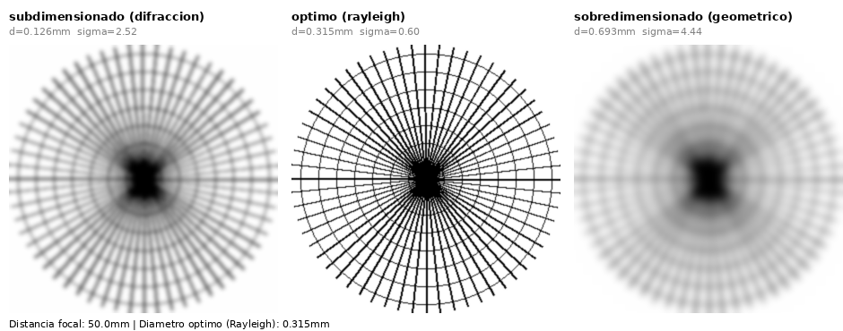

# Spike 001: Viabilidad de la simulación visual de imagen

**Fecha:** 2026-08-12
**Duración:** ~1 sesión de exploración
**Resultado:** ✅ Viable — gate superado
**Decisión derivada:** [ADR-0001](../adr/0001-simulacion-visual-vs-modelo-fisico.md)
**Código:** [`spikes/001_simulacion_imagen.py`](../../spikes/001_simulacion_imagen.py)

## Objetivo

Antes de invertir tiempo en diseño de interfaz (fase 3) y arquitectura
definitiva, validar si un blur gaussiano ponderado por el criterio de
Rayleigh produce un resultado **visualmente creíble** para tres escenarios:
orificio subdimensionado, óptimo y sobredimensionado.

Este spike actúa como *gate de decisión*: si el enfoque no fuera creíble, el
alcance del MVP se reduciría a validación numérica sin simulación visual
(ver [product-brief.md, sección 3](../product-brief.md#3-alcance-funcional)).

## Método

1. Generar una imagen de prueba sintética (patrón radial tipo "mira óptica"),
   útil para evaluar pérdida de resolución en todas direcciones.
2. Calcular el diámetro óptimo de pinhole con la aproximación de Rayleigh:
   `d_optimo = sqrt(2 * lambda * f)`.
3. Definir tres escenarios: `0.4×`, `1.0×` y `2.2×` el diámetro óptimo.
4. Mapear la desviación relativa de cada escenario a un `sigma` de blur
   gaussiano (`scipy.ndimage.gaussian_filter`) y renderizar el resultado.

## Iteración 1 — falla

**Parámetros:** `k=18`, sin límite superior de `sigma`.

**Resultado:** los escenarios subdimensionado y sobredimensionado produjeron
`sigma` de 11.4 y 22.2 respectivamente — la imagen quedaba completamente
ilegible, sin ningún detalle reconocible. El efecto dejaba de ser educativo:
un docente no podría usarlo para mostrar *por qué* un diseño es subóptimo,
solo vería una mancha uniforme.

## Iteración 2 — ajuste

**Cambios:** se redujo `k` de `18` a `3.2` y se añadió un límite `sigma_max=8.0`.

**Resultado:** los tres escenarios muestran degradación progresiva de
nitidez, con el centro (óptimo) claramente más definido que ambos extremos,
manteniendo detalle reconocible en todos los casos.

*Imagen generada por el spike: subdimensionado (sigma=2.52), óptimo
(sigma=0.60), sobredimensionado (sigma=4.44). Distancia focal de referencia:
50mm, diámetro óptimo calculado: 0.315mm.*

> **Nota (2026-08-13):** la fórmula de Rayleigh se corrigió posteriormente de
> `d=√(2·λ·f)` a `d=1.9·√(f·λ)` (constante empírica correcta, ver
> [product-brief.md, Referencias](../product-brief.md#referencias)). El
> diámetro óptimo cambió de 0.235mm a 0.315mm, pero como los tres escenarios
> se definen como proporciones del óptimo (0.4×/1.0×/2.2×), los valores de
> `sigma` y la conclusión del spike no cambian.

## Hallazgo principal

El enfoque de blur gaussiano ponderado por Rayleigh es viable, pero **no de
forma ingenua**: requiere una constante de escala calibrada y un límite
superior explícito. Sin ese límite, cualquier desviación grande del óptimo
(común en el rango de inputs que un usuario real probará) destruye la imagen
en lugar de degradarla progresivamente.

## Decisión

Aceptado. Se documenta como [ADR-0001](../adr/0001-simulacion-visual-vs-modelo-fisico.md).
Los parámetros `k`, `sigma_base` y `sigma_max` deben implementarse como
constantes nombradas y documentadas en el backend, no como valores
hardcodeados sin explicación — trazabilidad directa a este spike.

## Próximo paso

Fase 3 — wireframes de la interfaz, ahora con la certeza de que el efecto
visual central del producto es técnicamente viable.
